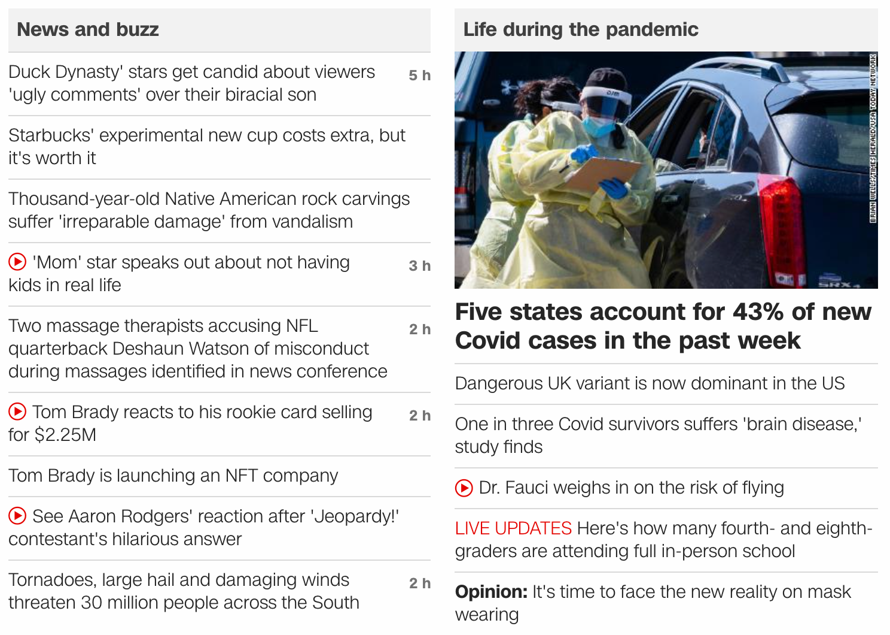
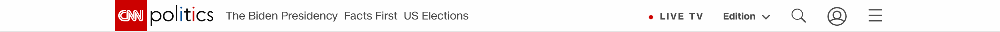
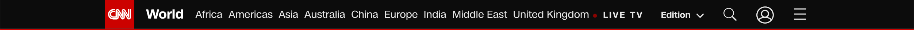
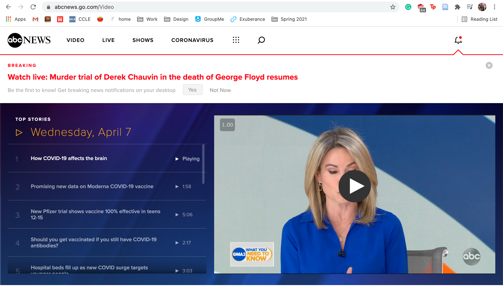

# Assignment #01: Increasing Readability of News Outlet Websites
Kelly Zhong, DH 110
 
 

### Project Background
During the start of this year, I started to follow the news more than ever before. Because of the severity and importance of everything that has been happening in the world, such as the COVID-19 pandemic, Black Lives Matter, the California fires, the election, and now AAPI hate, it was important for me to keep up with and educate myself on current events. I have mainly been using <a href="https://www.cnn.com/"> CNN</a>, which I have noticed many UX problems with. Upon visiting other news outlet websites, such as <a href="https://www.abcnews.go.com/"> ABC News</a>, I noticed that they all had similar problems with readability and organization. Their homepages were overwhelmed with information that I believe would benefit from some user experience changes. By improving the user experience and organization of their websites, news outlets would be able to **1. ensure that top news is emphasized/ made aware of to users, 2. help users to more easily find news that they are interested in, and 3. prevent certain news articles from being lost in the plethora of content.**
 
 

### <a href="https://www.cnn.com/"> #1. CNN </a>

 

**Background**: CNN.com is the website of the news television channel, CNN (Cable News Network). The site communicates the top news in the world to its viewers; content fall under a variety of topics, such as news in the US, news in the world, politics, business, health, entertainment, tech, travel, sports, weather, and more. The website also includes easy-access links to their live television channel. I chose this website because I consume news from it daily.
 

**Overall evaluation**: When I first visited the website, I was overwhelmed with all of the text and information that was thrown at me. The varying text sizes and text treatments negatively affected the readability of the site, and I didn't know where to look first. Furthermore, the organization of the homepage did not help to sort the huge abundance of links and clickable text. 
 
 

*Note: images referred to are below the chart*
Heuristics | Analyses | Recommmendations
------------ | ------------ | ------------
#1: Visibility of system status | **Issue (Rating: 1) -** The CNN red color is used both as a link hover color and also as a way to call out text. This is confusing, because users are unsure if red text is clickable or not. | Use a different link hover style. For example, lightening the text to a gray, or making the text underlined, could decrease confusion.
#2: Match between system and real world | **Issue (Rating: 1) -** Because of the layout, it is unclear whether each image, title, and text group is one news article, or if it's a topic that has unrelated articles underneath it. | Use clearer and cohesive methods of article organization, such as symbols or descriptive text. Ex: Using the word "topic: " before headlines. 
#3: User control and freedom | **Issue (Rating: 1) -** When visiting an article, a video automatically starts to play. Though this may be helpful for some, it can be distracting and overwhelming to have video and article text input thrown at a user at the same time. In this sense, users have less control because they do not get to choose whether a video gets played or not. | Remove the auto-play function of the video.
#4: Consistency and standards | **Issue 1 (Rating: 2) -** Link and hover colors are inconsistent. Some articles have blue link colors instead of the original red. **Issue 2 (Rating: 1) -** The navigation bar changes depending on the article, since each article leads to a different section of the website depending on the article topic. **Issue 3 (Rating: 2, Image 1) -** Some article groups on the home page have features that others don't. For example, the "News and buzz" section has time since posted, but others don't. | Fix the inconsistencies: choose one link and hover style, make returning to the homepage navigation clearer, and unify article group features.
#5: Error prevention | **Issue (Rating: 1) -** It would be helpful to perform searches within each section of the website, rather than just for the whole site overall. For example, it would benefit users if they could search up specific news about the election in the "Politics" section of the website. | Incorporate search functions within subpages.
#6: Recognition rather than recall | **Issue 1 (Rating: 1) -** The search engines could provide search suggestions when users are typing, based on keywords. **Issue 2 (Rating: 2, Image 2) -** Inconsistent navigation bars make it hard for users to understand where in the website they are. | Add search suggestions and redesign navigation bars to look cohesive.
#7: Flexibility and efficiency of use | **Issue (Rating: 2) -** The homepage organization is extremely confusing, with different chunks of information that are not organized in a cohesive manner. This makes the website hard to use and inefficient. | Use better methods of organization that make information visualization clearer to users.
#8: Aesthetic and minimalist design | **Issue (Rating: 2) -** Website is not aesthetic nor minimal. The abundance of text and lack of spacing gives the website a crammed look. | Increase spacing between text and use cohesive text styles.
#9: Help users recognize, diagnose, and recover from errors | **Issue (Rating: 1) -** There are no indications for what the articles under the big bolded texts are. Some articles are related to the big bolded text, while others aren't. Users could click on articles thinking that they are related to a topic, when they are actually unrelated. | Utilize symbols, text, or other designe elements to more clearly portray information.
#10: Help and documentation | **Issue (Rating: 3) -** There are no noticeable help or FAQ pages. | Add a help or FAQ page.
 
 

**Images**
Image # | Image
------- | -------
1 | 
2 |  
 
 

### <a href="https://abcnews.go.com/"> #2. ABC News </a>

 

**Background**: The ABC News website is the website of the ABC News television network. The site acts as a source for users to catch up with the top news in the world. News covered fall into categories of U.S., International, Politics, Business, Entertainment, Lifestyle, Health, Virtual Reality, Weather, etc. Users can also choose between sections of videos, Live, shows, and the Coronavirus. 
 

**Overall evaluation**: Upon viewing the site, I felt that it looked cleaner and easier to navigate than CNN's website. There is more spacing between text, and sections are more comprehendable. However, there are still some inconsistencies and organization issues that ABC News could benefit from solving. 
 
 

*Note: images referred to are below the chart*
Heuristics | Analyses | Recommmendations
------------ | ------------ | ------------
#1: Visibility of system status | **Issue (Rating: 3, Image 1) -** There is no indication what page the user is on when a section on the nav bar is clicked. In the image, you can see that though the user is on the Video page, it is not shown in the nav bar or anywhere on the page. | Indicate on the nav bar which page is currently being visited. This can be done by bolding or changing the color of the text. 
#2: Match between system and real world | **Issue 1 (Rating: 2, Image 2) -** It is unclear what the 3x3 dot grid symbol on the nav bar means, as this is not a symbol that is commonly used. **Issue 2 (Rating: 2, Image 3) -** It is unclear what the group of articles on the left is, and why it is relevant. | It would be helpful to change the symbol to the word "Topics". A descriptive title such as "Top News" on top of the group of articles would be beneficial.
#3: User control and freedom | Analyses | Recommmendations
#4: Consistency and standards | Analyses | Recommmendations
#5: Error prevention | Analyses | Recommmendations
#6: Recognition rather than recall | Analyses | Recommmendations
#7: Flexibility and efficiency of use | Analyses | Recommmendations
#8: Aesthetic and minimalist design | Analyses | Recommmendations
#9: Help users recognize, diagnose, and recover from errors | Analyses | Recommmendations
#10: Help and documentation | Analyses | Recommmendations

**Images**
Image # | Image
------- | -------
1 | 
 
 
