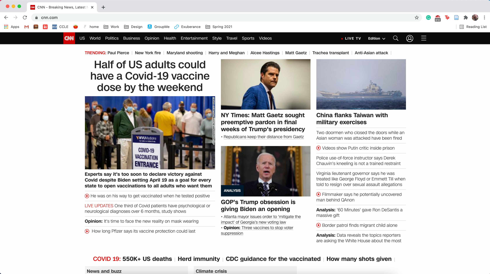
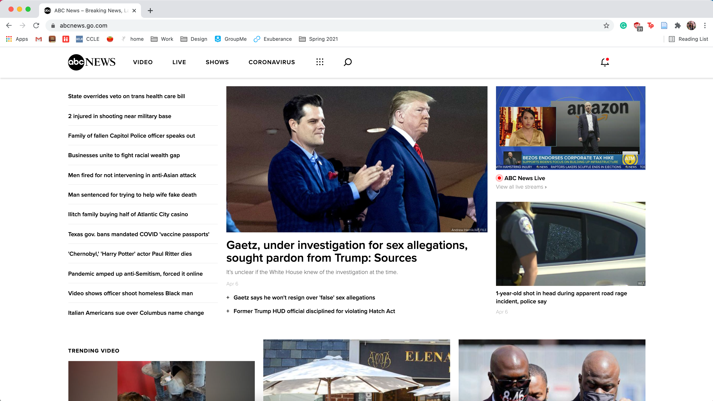

# Assignment #01: Increasing Readability of News Outlet Websites
Kelly Zhong, DH 110
 
 

### Project Background
- started following the news bc of everything that's been happening in the world: corona, blm, fires, the election, and now aapi
- i feel like there's a lot to learn about and keep up with 
- i've mainly been using cnn, but i noticed that most news sites tend to be hard to read and super clustered 
- by improving the ux and organization, news outlets would be able to 1. help users to more easily find news that they are interested in, 2. ensure that certain news articles are not lost in the big crowd, 3. ensure that top news is emphasized/ made aware of to users
 
 

### <a href="https://www.cnn.com/"> #1. CNN </a>

 

**Background**: lorem ipsum
 

**Overall evaluation**: lorem ipsum
 
 

Heuristic | Analyses | Recommmendations
------------ | ------------ | ------------
#1: Visibility of system status | Analyses | Recommmendations
#2: Match between system and real world | Analyses | Recommmendations
#3: User control and freedom | Analyses | Recommmendations
#4: Consistency and standards | Analyses | Recommmendations
#5: Error prevention | Analyses | Recommmendations
#6: Recognition rather than recall | Analyses | Recommmendations
#7: Flexibility and efficiency of use | Analyses | Recommmendations
#8: Aesthetic and minimalist design | Analyses | Recommmendations
#9: Help users recognize, diagnose, and recover from errors | Analyses | Recommmendations
#10: Help and documentation | Analyses | Recommmendations
 
 

### <a href="https://abcnews.go.com/"> #2. ABC News </a>

 

**Background**: lorem ipsum
 

**Overall evaluation**: lorem ipsum
 
 

Heuristic | Analyses | Recommmendations
------------ | ------------ | ------------
#1: Visibility of system status | Analyses | Recommmendations
#2: Match between system and real world | Analyses | Recommmendations
#3: User control and freedom | Analyses | Recommmendations
#4: Consistency and standards | Analyses | Recommmendations
#5: Error prevention | Analyses | Recommmendations
#6: Recognition rather than recall | Analyses | Recommmendations
#7: Flexibility and efficiency of use | Analyses | Recommmendations
#8: Aesthetic and minimalist design | Analyses | Recommmendations
#9: Help users recognize, diagnose, and recover from errors | Analyses | Recommmendations
#10: Help and documentation | Analyses | Recommmendations
